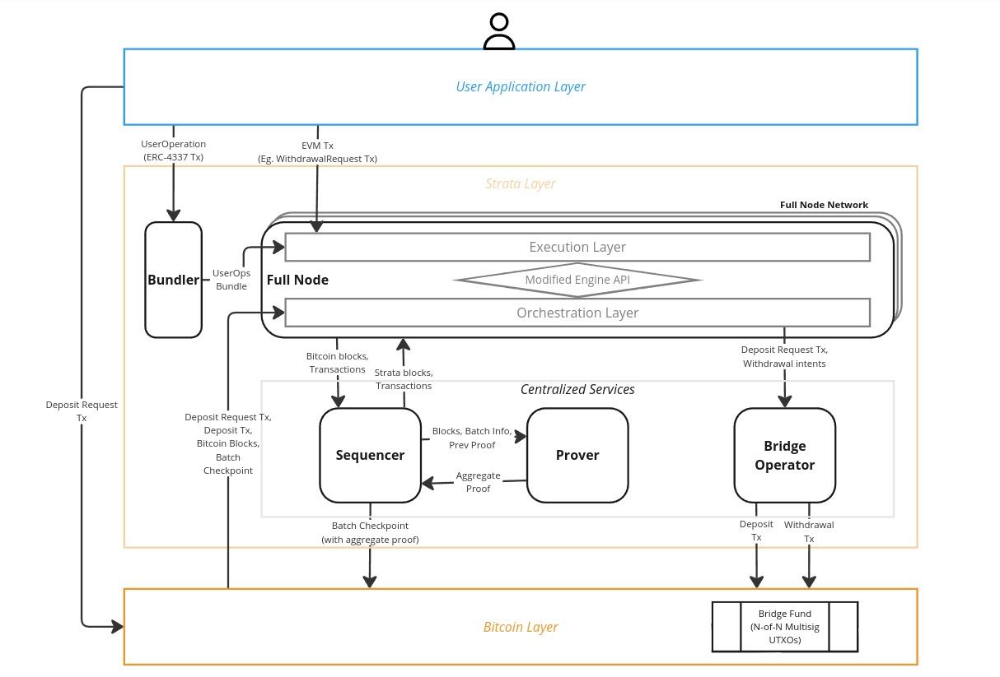

# System architecture

!!! note

    Although Strata is designed to run on bitcoin mainnet,
    currently Strata is only running on a bitcoin signet.
    Any references to bitcoin or BTC in this documentation should be read
    as "bitcoin signet" or "signet BTC" when describing the current system.

Strata is an EVM blockchain that uses bitcoin as a source of truth
for state commitments and proof of valid state transitions.
The user's application layer interacts with Strata in three ways:

1. Through the **full node**,
   which provides both Ethereum-compatible RPCs and additional Strata RPCs,
   enabling users to send EVM transactions to Strata.
2. Through the **bundler**,
   which handles the bundling of account abstraction (ERC-4337) transactions,
   also known as UserOperations.
3. Through **bitcoin**,
   which allows users to deposit BTC into the Strata system.

<figure markdown="span">
  { loading=lazy }
  <figcaption>
    Architecture diagram.
  </figcaption>
</figure>

The diagram above illustrates the overall system architecture and
the data flow between different components of Strata
and the entities interacting with the system.
There are three layers: bitcoin layer at the base, Strata layer above it,
and the user application layer that sits on top of the Strata layer.
The direction of arrows indicate the direction of
data flow between the components,
and the text in the arrows indicate the data.
The centralized services are the services that are run by Alpen Labs.
Other components within Strata layer (the bundler and the full node)
can be run by anyone in our devnet community.

## User application layer

The user application layer is not part of Strata but includes any interface
or application that acts as a gateway for users to interact with Strata.
These applications include wallets
(e.g. EOA wallets, account abstraction wallets, bitcoin wallets),
decentralized applications (e.g. Uniswap),
smart contract deployment tools (e.g. Foundry),
and command-line interface tools (e.g. Cast).
They interact programmatically with a Strata full node,
bundler, and bitcoin through an RPC interface provided by each service,
and the RPC interfaces enable applications to interact with Strata,
including deploying smart contracts,
sending EOA or account-abstraction transactions,
and initiating deposits into Strata.

## Bundler

The bundler supports account abstraction by accepting `UserOperation` transactions
as defined by [ERC-4337](https://www.erc4337.io/docs/understanding-ERC-4337/user-operation).
It bundles these transactions and relays them to the full node.

We have deployed a bundler for devnet that developers can use as
an endpoint to send UserOperations.
Anyone else can also run their own bundler to connect with
the full node network independently.

## Full node

A full node is a software client that runs Strata’s core logic
and provides an RPC interface for programs to interact with Strata.
It receives transactions from the user application layer or bundler
and relays them to the sequencer.
Periodically, the full node polls the sequencer for new blocks.
If new blocks are available,
they are then downloaded and executed against the full node's current state,
advancing the state.
This new state remains unconfirmed until the full node sees that
the relevant batch checkpoint posted on bitcoin by the sequencer
has been confirmed.

Internally, a full node is constructed similarly to a post-merge Ethereum full node,
keeping modularity in mind,
separating the node into an execution layer
and an orchestration layer. They interact with each other
through a slightly modified Engine API, which we extended to handle
bridge transfers in/out of execution layer.

For devnet, Alpen is running a full node that developers
can connect to via RPC to interact with Strata.
Additionally, anyone in the devnet community can run their own full node
by building the full node source code.

## Sequencer

The sequencer is currently a centralized component that performs
the functions of sequencing transactions in its mempool,
validating the transactions, bundling the valid transactions into blocks,
creating and signing a new block of transactions approximately
every 5 seconds, and sharing blocks with full nodes upon request.
The sequencer also decides the range of blocks (aka a batch) to be proven,
relays that information to the prover, and posts the batch checkpoint to bitcoin.
A batch checkpoint includes the batch metadata and the proof generated by the prover.

The sequencer is therefore the primary component in
the Strata system performing the necessary actions
that enable full nodes to advance the chain to the next state.

For devnet, Alpen runs the sequencer,
and full nodes only accept checkpoints signed by the sequencer.

## Prover

The prover gets information from the sequencer about the next batch
the prover is generating a proof for.
The prover then produces a recursive validity proof that proves
the validity of the current batch, as well as all batches before it,
according to the Strata consensus rules.
At a high level, the proof ensures that:

1. All bitcoin blocks in the batch have been thoroughly scanned
   for user deposit transactions, previous proofs, and checkpoints.
2. The state transition resulting from executing
   the current batch and deposit transactions is valid.
3. The previous batch proof on bitcoin is valid.

This recursive proof enables a verifier to validate
the Strata chain's entire history,
from genesis to the latest state.
The proof is passed to the sequencer,
who then posts it to the bitcoin network along with the batch metadata
(state commitments).

!!! info

    For devnet, even though Strata produces recursive proofs and posts them
    to our private signet network,
    we use devnet as a testing and experimentation ground for proofs,
    starting and stopping proof generation at unpredictable times.
    Therefore, external systems should not assume that
    each proof proves state transition from genesis.
    Rather, each proof accompanies public inputs that mention
    the range of batches it proves recursively.
    Full nodes in the Strata devnet network do not depend on proofs
    but can re-execute blocks to transition states.
    The next Strata milestone will support nodes that fully depend on
    proofs posted on the bitcoin layer for their state.

## Bridge operator

A bridge operator is one of $N$ nodes collectively performing
the functions of processing user deposit and withdrawal requests by locking
the user's BTC in the $N$-of-$N$ multisig on bitcoin and by releasing
the appropriate amount of BTC back to the user's bitcoin address,
respectively.
Each bridge operator monitors bitcoin for a special deposit request transaction,
in which the user allows the bridge operators to transfer the user's BTC to
an $N$-of-$N$ multisig address within a specified amount of time.
The bridge operators then cooperate and sign a deposit transaction
that transfers the user's funds to the $N$-of-$N$ multisig address within
the alloted time.
When this transaction is confirmed on bitcoin,
an equivalent amount of BTC is minted to the user's designated Strata account.
Similarly, for each confirmed withdrawal request on Strata,
the bridge operators cooperate to sign and broadcast
a withdrawal transaction to bitcoin that transfers
the appropriate BTC amount to the user's designated bitcoin address.
Detailed descriptions of the deposit and withdrawal mechanisms can be found
in the [bitcoin bridge documentation](bitcoin-bridge.md).
Currently, the bridge is an $N$-of-$N$ multisig,
with all bridge operators run by Alpen.
A more secure bridge that provides
a single-functional-user trust assumption is targeted for
the next major Strata release.
