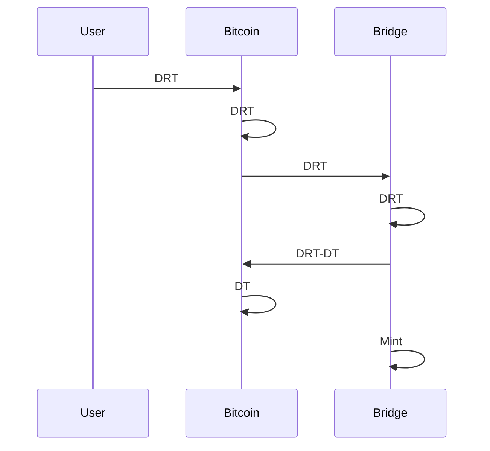
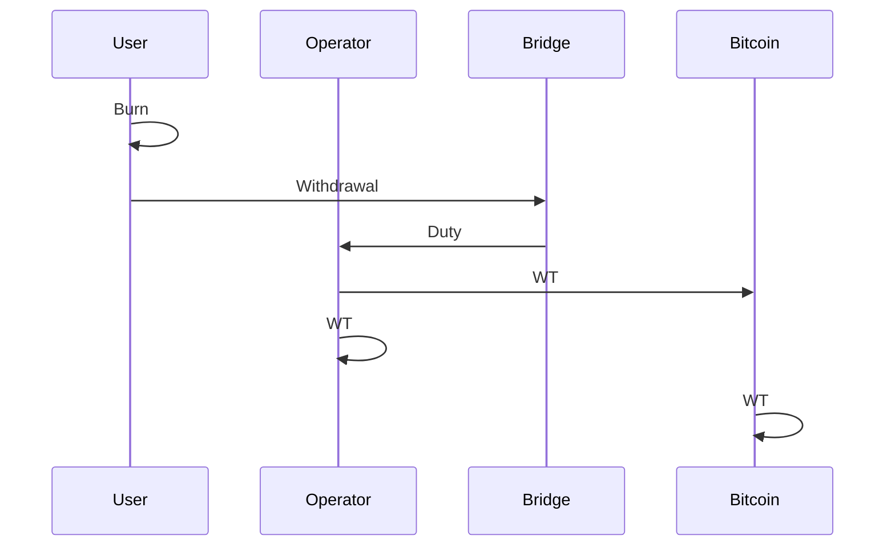

# Bitcoin Bridge

The Bitcoin bridge is a two-way peg program between Bitcoin and Alpen Labs' rollup.
It is a federated bridge, where a group of operators
sign transactions to move funds into the rollup,
whereas the user can withdraw funds from the rollup with the guarantee
that at least one operator is honest.

!!! info

    The current bridge design assumes an N-of-N cooperation amongst
    the bridge operators.
    Future designs will enhance the security model of the bridge operation.

The deposit flow is composed of a Deposit Request Transaction (DRT)
which is fulfilled by the bridge federation with a Deposit Transaction (DT).
The user should provide an Execution Layer (EL) address to receive the funds
in the rollup.

The withdrawal request is assigned to an operator that fulfills it
with the Bridge's funds with a Withdrawal Transaction (WT),
and then collects the signatures from the bridge federation.

!!! note

    Deposits and withdrawals are allowed in a denomination of $D$ BTC where
    $D = 10 \ \text{BTC}$ is a value predefined by the bridge federation.

!!! info

    All the multisigs in the deposit and withdraw follows
    the [MuSig2](https://github.com/bitcoin/bips/blob/master/bip-0327.mediawiki)
    protocol, where signatures are aggregated into a single signature
    that validates all $n$ participants' partial signatures.

## Deposit

The deposit process is initiated by the user,
who sends 10[^fees] BTC to a P2TR address, where:

[^fees]: The user must pay the Bitcoin network fees for both the Deposit Request and Deposit Transactions.

1. The key path spend is unspendable, following
   [BIP 341](https://github.com/bitcoin/bips/blob/master/bip-0341.mediawiki#constructing-and-spending-taproot-outputs)
   with a "NUMS"[^nums] point added to the random scalar
   $r = \text{0x82758434e13488368e0781c4a94019d3d6722f854d26c15d2d157acd1f464723}$.

[^nums]:
    "Nothing Up My Sleeve" (NUMS) point,
    i.e., a point with unknown discrete logarithm, chosen as $H = lift_x(G)$
    where $G$ is the secp256k1 generator point,
    as per [BIP 341](https://github.com/bitcoin/bips/blob/master/bip-0341.mediawiki#constructing-and-spending-taproot-outputs).
    An unspendable pubkey is a point on the curve whose discrete log
    is not known with respect to the generator point $G$.
    This can be verified by revealing the random scalar $r$
    used to generate the pubkey by shifting the NUMS point.

1. The script path spend has two paths:
   1. "deposit path", an $n$-of-$n$ multisig path,
      where $n$ is the number of operators in the bridge.
   1. "take back" path,
      which allows the user to take back their funds if the bridge fails to
      move funds from the Deposit Request Transaction (DRT)
      into the bridge address within a two-week period,
      i.e. it is time-locked and the user provides a signature to spend it.

This transaction has some metadata attached to it, in the form of an `OP_RETURN`
output, that can be up to 80-bytes long (according to Bitcoin consensus rules);
and is composed of the following data:

1. Magic bytes in the form `OP_PUSHBYTES_11 <some magic bytes>`.
   These take $1 + 11 = 12$ bytes and are used to identify the bridge.
1. "Take back" TapLeaf hash as `OP_PUSHBYTES_32 <take back leaf hash>`.
   These take $1 + 32 = 33$ bytes and are used to validate the
   Deposit Request Transaction (DRT),
   while also necessary for the control block required
   to spend the P2TR output via the $n$-of-$n$ Tapscript.
1. Execution layer (EL) Address as `OP_PUSHBYTES_20 <el_address>`.
   The Execution Layer (EL) address is the address in the rollup where
   the user wants to receive the funds (sBTC) in the rollup.
   It is a 20-byte Ethereum Virtual Machine (EVM) address.
   This is $1 + 20 = 21$ bytes long.

The bridge monitors the blockchain for incoming transactions,
which can be detected by the `OP_RETURN` output.
Once the bridge detects the Deposit Request Transaction (DRT),
it verifies the "take back" TapLeaf hash, the multisig pubkey path,
and the full Taproot commitment.

If the Deposit Request Transaction (DRT) is valid,
the bridge operators fulfill the deposit with a Deposit Transaction (DT)
that transfers the BTC to the bridge address's UTXO set
and also mints the same amount of sBTC in the rollup to
the Execution Layer (EL) address provided by the user.

Below in the figure is the deposit flow:

## Withdrawal

All withdrawals take place through the bridge's UTXO set.

The user requests a withdrawal in the rollup and an operator is assigned to
fulfill the request in the Bitcoin network:

1. The user requests a withdrawal from the rollup making sure to burn the
   same amount of `sBTC`.
1. The assigned operator creates and signs a Withdrawal Transaction
   (WT) where they spend 10 BTC from the Bridge Address' UTXO set,
   while subtracting the operator's fee and the transaction fee;
   and requests the other $N−1$ operators to sign
   the Withdrawal Transaction.
1. Once all the signatures have been aggregated, the transaction is submitted to
   the Bitcoin network.
1. Once the transaction is confirmed,
   the withdrawal request is fulfilled.

The withdrawal flow is shown below:

