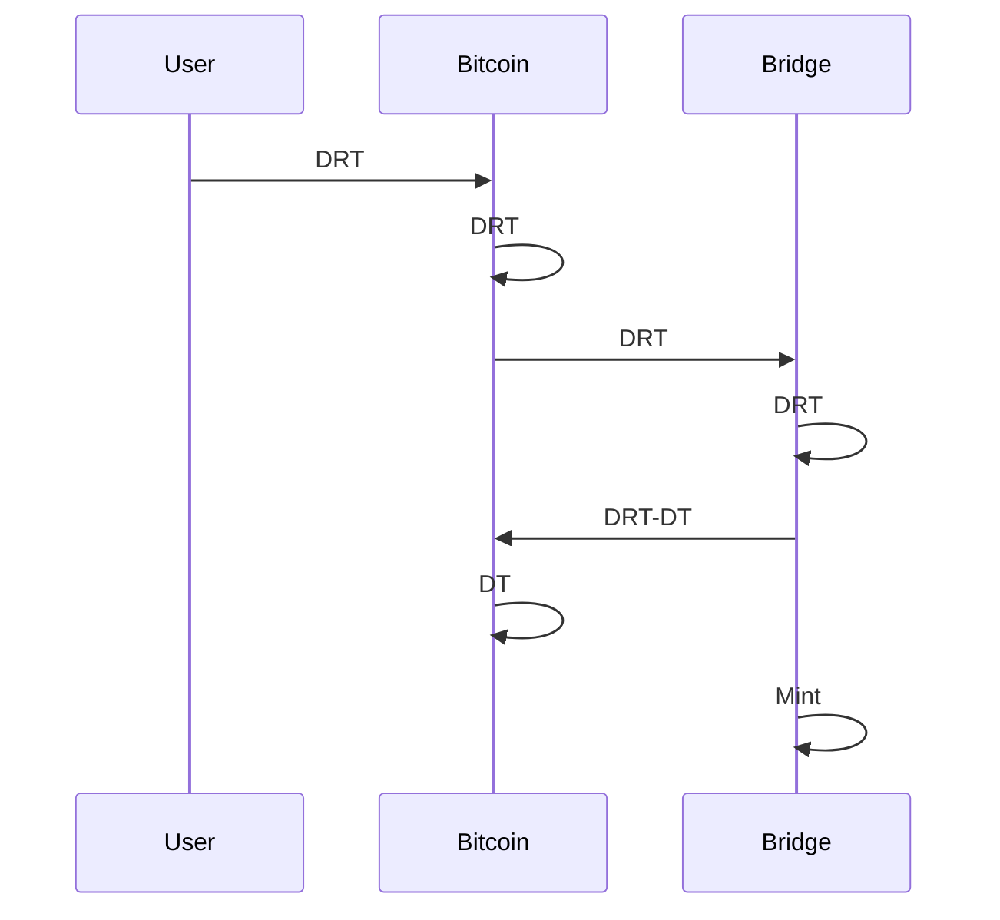
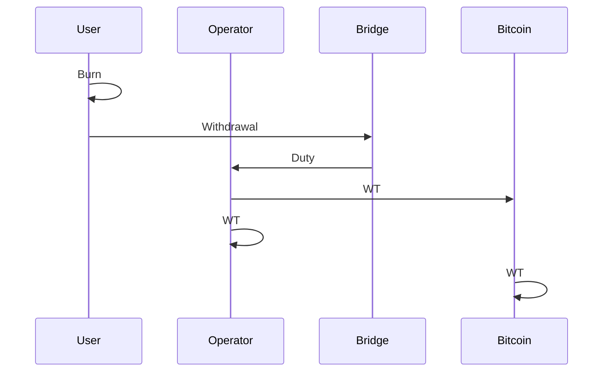

# Bitcoin bridge

!!! note

    Although Strata is designed to run on bitcoin mainnet,
    currently Strata is only running on a bitcoin signet.
    Any references to bitcoin or BTC in this documentation should be read
    as "bitcoin signet" or "signet BTC" when describing the current system.

The Strata bitcoin bridge enables the transfer of BTC between the bitcoin
and Strata blockchains.
The bridge is run by a federation of operators who
co-sign transactions to move BTC into and out of the Strata bridge address.

!!! info

    The current bridge design assumes an N-of-N cooperation amongst
    the bridge operators.
    Future designs will improve the liveness and safety guarantees of the bridge.

The deposit flow is composed of a Deposit Request Transaction (DRT)
which is fulfilled by the bridge federation with a Deposit Transaction (DT).
The user must provide an Execution Layer (EL) address to receive BTC on Strata.

The withdrawal request is assigned to an operator who fulfills the request
by creating a transaction spending BTC from the bridge address to the user's
specified withdrawal address. Once the other `N-1` operators co-sign this transaction
it is broadcast to bitcoin for confirmation.

!!! note

    Deposits and withdrawals are allowed in a denomination of $D$ BTC where
    $D = 10 \ \text{BTC}$ is a value predefined by the bridge federation.
    The operator fee is set at 5% of the bridge denomination. 
    The minimum relay fee for transactions is 10 satoshis per vByte.

!!! info

    All the multisigs in the deposit and withdrawal flows follow
    the [MuSig2](https://github.com/bitcoin/bips/blob/master/bip-0327.mediawiki)
    protocol, where signatures are aggregated into a single signature
    that validates all $N$ participants' partial signatures.

## Deposit

The deposit process is initiated by the user,
who sends 10[^fees] BTC to a P2TR address, where:

[^fees]: The user must pay the bitcoin network fees for both the Deposit Request and Deposit Transactions.

1. The key path spend is unspendable, following
   [BIP 341](https://github.com/bitcoin/bips/blob/master/bip-0341.mediawiki#constructing-and-spending-taproot-outputs)
   with a "NUMS"[^nums] point added to the random scalar
   $r = \text{0x82758434e13488368e0781c4a94019d3d6722f854d26c15d2d157acd1f464723}$.

[^nums]:
    "Nothing Up My Sleeve" (NUMS) point,
    i.e., a point with unknown discrete logarithm,
    constructed by taking the hash of the standard uncompressed encoding of
    the [secp256k1](https://www.secg.org/sec2-v2.pdf) base point $G$ as $X$ coordinate,
    as per [BIP 341](https://github.com/bitcoin/bips/blob/master/bip-0341.mediawiki#constructing-and-spending-taproot-outputs).
    An unspendable pubkey is a point on the curve whose discrete log
    is not known with respect to the generator point $G$.
    This can be verified by revealing the random scalar $r$
    used to generate the pubkey by shifting the NUMS point.

1. The script path spend has two paths:
    1. "Deposit path", an $N$-of-$N$ multisig path,
    where $N$ is the number of operators in the bridge.
    1. "Take back" path,
    which allows the user to take back their funds if the bridge fails to
    move funds from the Deposit Request Transaction (DRT)
    into the bridge address within approximately 8.5 hours,
    i.e. it is time-locked and the user can spend it by providing a signature.

This transaction has some metadata attached to it, in the form of an `OP_RETURN`
output, that can be up to 80 bytes long (according to bitcoin standardness policy),
and is composed of the following data:

1. Magic bytes.
   These take $11$ bytes and are used to identify the bridge.
2. "Take back" TapLeaf hash.
   These take $32$ bytes and are used to validate the
   Deposit Request Transaction (DRT),
   while also necessary for the control block required
   to spend the P2TR output via the $N$-of-$N$ Tapscript.
3. Execution Layer (EL) address.
   The Execution Layer (EL) address is the Strata address where
   the user wants to receive the BTC in Strata.
   It is a 20-byte Ethereum Virtual Machine (EVM) address.
   This is $20$ bytes long.

The bridge monitors the blockchain for incoming transactions,
which can be detected by the `OP_RETURN` output.
Once the bridge detects the Deposit Request Transaction (DRT),
it verifies the "take back" TapLeaf hash, the multisig pubkey path,
and the full Taproot commitment.

If the Deposit Request Transaction (DRT) is valid,
the bridge operators fulfill the deposit with a Deposit Transaction (DT)
that transfers the BTC to the bridge address's UTXO set
and also mints the same amount of BTC to
the Execution Layer (EL) address provided by the user.

Below in the figure is the deposit flow:

## Withdrawal

The user requests a withdrawal on Strata and an operator is assigned to
fulfill the request on bitcoin:

1. The user initiates a withdrawal request, in response to which
    the corresponding amount of strata BTC or `sBTC` is burned from Strata.
1. After the burn is confirmed, the assigned operator creates
   and signs a Withdrawal Transaction (WT) on the Bitcoin blockchain
   where they spend 10 BTC from the bridge address' UTXO set,
   while subtracting the operator's fee (5% of the bridge denomination)
   and the mining fee (minimum 10 satoshis per vByte),
   and requests the other $N-1$ operators to sign
   the Withdrawal Transaction.
1. Once all the signatures have been aggregated, the transaction is submitted to
   bitcoin.
1. Once the transaction is confirmed,
   the withdrawal request is fulfilled.

The withdrawal flow is shown below:

